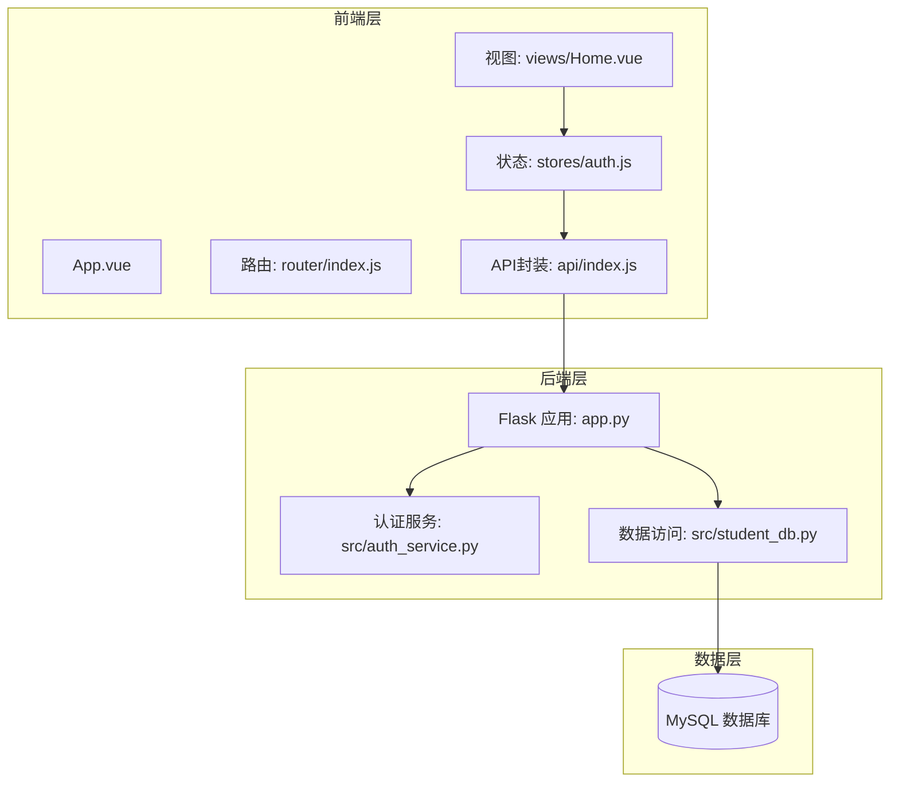
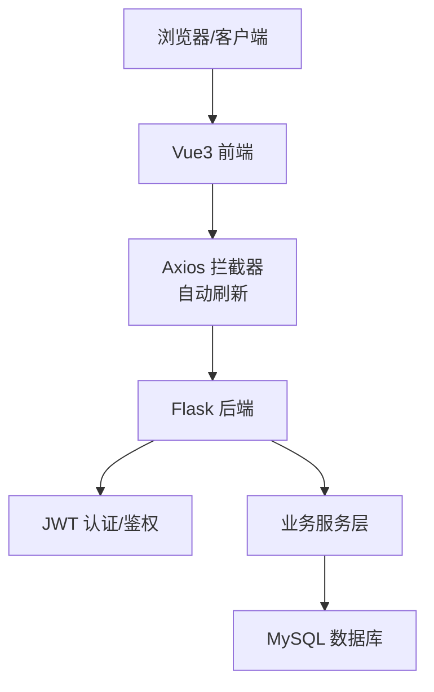
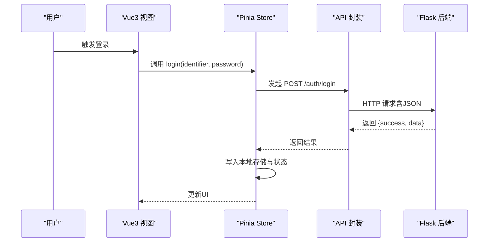
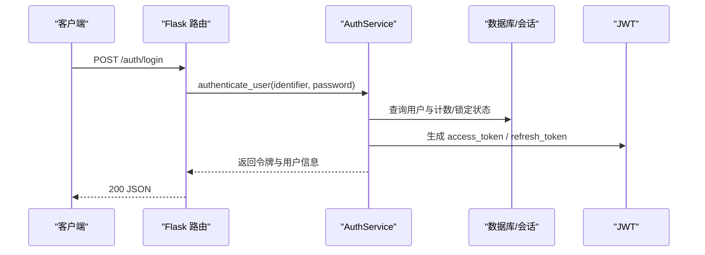
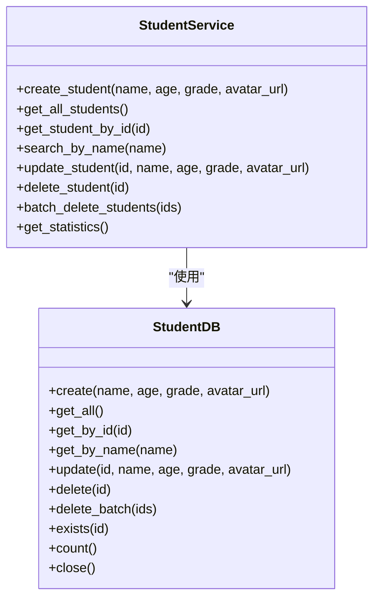
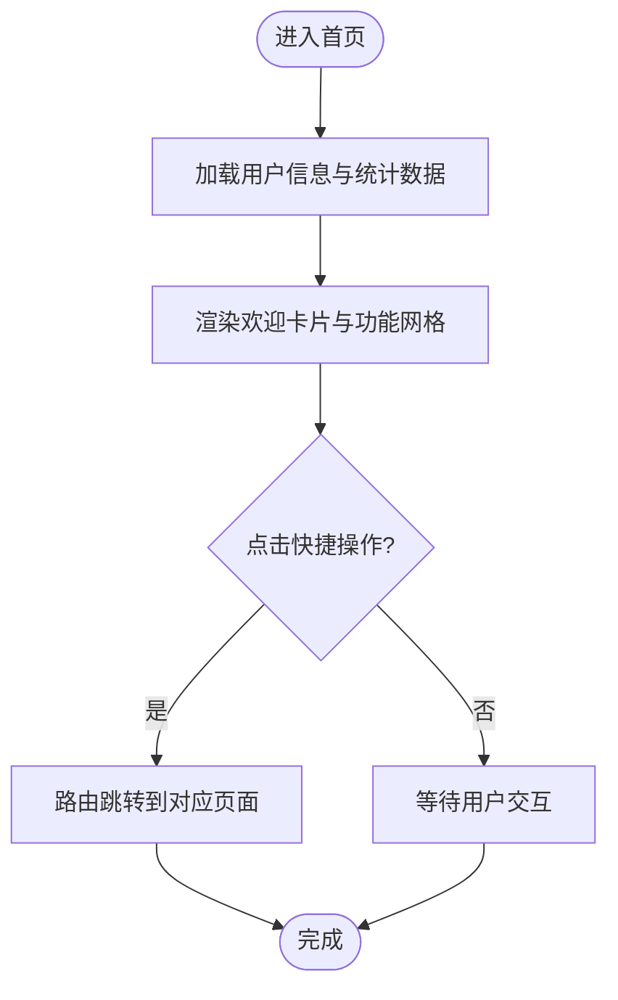
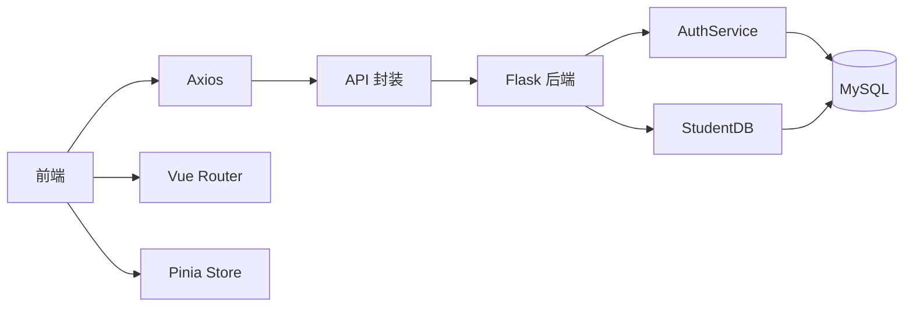
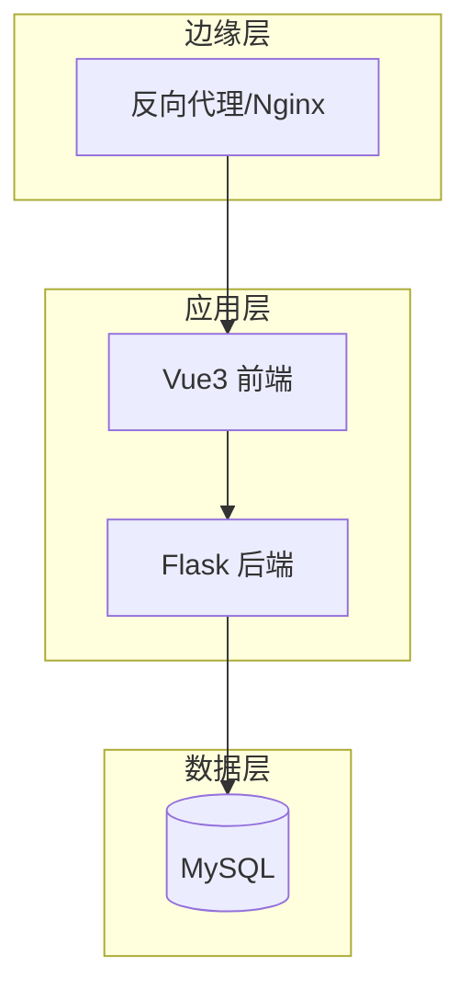

# 系统架构

<cite>
**本文引用的文件**   
- [app.py](file://python/app.py)
- [requirements.txt](file://python/requirements.txt)
- [main.js](file://python-web/src/main.js)
- [package.json](file://python-web/package.json)
- [index.js](file://python-web/vite.config.js)
- [index.js](file://python-web/src/router/index.js)
- [auth.js](file://python-web/src/stores/auth.js)
- [index.js](file://python-web/src/api/index.js)
- [student.js](file://python-web/src/api/student.js)
- [models.py](file://python/src/models.py)
- [student_db.py](file://python/src/student_db.py)
- [auth_service.py](file://python/src/auth_service.py)
- [Home.vue](file://python-web/src/views/Home.vue)
- [App.vue](file://python-web/src/App.vue)
- [main.py](file://python/main.py)
</cite>

## 目录
1. [引言](#引言)
2. [项目结构](#项目结构)
3. [核心组件](#核心组件)
4. [架构总览](#架构总览)
5. [详细组件分析](#详细组件分析)
6. [依赖分析](#依赖分析)
7. [性能考虑](#性能考虑)
8. [故障排查指南](#故障排查指南)
9. [结论](#结论)
10. [附录](#附录)

## 引言
本系统是一个前后端分离的学生管理系统，采用Flask作为后端API服务，Vue3作为前端应用框架，结合MySQL数据库进行数据持久化。系统支持用户认证与授权、任务管理、爬虫数据采集与导出、以及基础的学生信息管理能力。本文档从架构视角阐述系统的整体设计、组件交互、数据流与通信协议，并讨论微服务化倾向与模块化设计原则、系统边界、技术选型理由与架构权衡，同时给出部署拓扑与可扩展性建议。

## 项目结构
系统分为三层：
- 前端层（Vue3 + Vite）：负责用户界面、路由与状态管理，通过Axios与后端API通信。
- 后端层（Flask）：提供REST风格API，处理认证、业务逻辑与数据访问。
- 数据层（MySQL）：存储用户、任务、爬虫数据等。

**图表来源**
- [App.vue:1-10](file://python-web/src/App.vue#L1-L10)
- [index.js:1-66](file://python-web/src/router/index.js#L1-L66)
- [auth.js:1-74](file://python-web/src/stores/auth.js#L1-L74)
- [index.js:1-95](file://python-web/src/api/index.js#L1-L95)
- [Home.vue:1-1055](file://python-web/src/views/Home.vue#L1-L1055)
- [app.py:1-1715](file://python/app.py#L1-L1715)
- [auth_service.py:1-187](file://python/src/auth_service.py#L1-L187)
- [student_db.py:1-259](file://python/src/student_db.py#L1-L259)

**章节来源**
- [main.js:1-16](file://python-web/src/main.js#L1-L16)
- [package.json:1-24](file://python-web/package.json#L1-L24)
- [index.js:1-11](file://python-web/vite.config.js#L1-L11)
- [requirements.txt:1-13](file://python/requirements.txt#L1-L13)

## 核心组件
- 前端应用
  - 入口与插件：应用初始化、Pinia状态管理、Element Plus UI、Vue Router。
  - 路由守卫：基于登录态与meta字段控制页面访问。
  - 状态管理：认证状态、用户信息、本地持久化。
  - API封装：统一基地址、请求拦截器、响应拦截器与自动刷新。
- 后端API
  - 认证与安全：JWT生成与校验、黑名单、登录限制、密码哈希与历史校验。
  - 业务路由：用户认证、任务管理、爬虫任务、数据导出等。
  - 数据访问：数据库连接、表结构、增删改查与批量操作。
- 数据库
  - 学生表：基础字段与时间戳；服务层提供创建、查询、更新、统计等方法。

**章节来源**
- [main.js:1-16](file://python-web/src/main.js#L1-L16)
- [index.js:1-66](file://python-web/src/router/index.js#L1-L66)
- [auth.js:1-74](file://python-web/src/stores/auth.js#L1-L74)
- [index.js:1-95](file://python-web/src/api/index.js#L1-L95)
- [app.py:1-1715](file://python/app.py#L1-L1715)
- [auth_service.py:1-187](file://python/src/auth_service.py#L1-L187)
- [student_db.py:1-259](file://python/src/student_db.py#L1-L259)

## 架构总览
系统采用前后端分离架构，前端通过HTTP协议与后端交互，后端提供REST API，使用JWT进行认证与授权。系统具备模块化特征：认证服务独立、数据库访问抽象、前端状态与路由清晰分离。当前为单体式后端，但通过模块划分与服务类设计，具备向微服务演进的倾向。

**图表来源**
- [index.js:1-95](file://python-web/src/api/index.js#L1-L95)
- [app.py:1-1715](file://python/app.py#L1-L1715)
- [auth_service.py:1-187](file://python/src/auth_service.py#L1-L187)
- [student_db.py:1-259](file://python/src/student_db.py#L1-L259)

## 详细组件分析

### 前端应用架构
- 应用入口与插件
  - 初始化Vue实例、Pinia、Element Plus、路由。
- 路由与导航
  - 定义登录、注册、主页、个人中心、爬虫等功能路由。
  - 路由守卫根据登录状态与meta字段决定是否放行。
- 状态管理（Pinia）
  - 维护访问令牌、刷新令牌、用户信息，支持登录、注册、登出、拉取资料。
- API封装
  - 统一基地址、超时、Content-Type。
  - 请求拦截器注入Authorization头。
  - 响应拦截器处理401并自动刷新令牌，失败则跳转登录。

**图表来源**
- [auth.js:1-74](file://python-web/src/stores/auth.js#L1-L74)
- [index.js:1-95](file://python-web/src/api/index.js#L1-L95)

**章节来源**
- [main.js:1-16](file://python-web/src/main.js#L1-L16)
- [index.js:1-66](file://python-web/src/router/index.js#L1-L66)
- [auth.js:1-74](file://python-web/src/stores/auth.js#L1-L74)
- [index.js:1-95](file://python-web/src/api/index.js#L1-L95)

### 后端API与认证服务
- Flask应用
  - 跨域配置允许前端开发端口。
  - 提供认证、任务、爬虫、健康检查等路由。
  - 参数校验、异常处理、审计日志记录。
- 认证服务
  - 密码哈希（bcrypt）、JWT签发与解码。
  - 登录限制、账户锁定、Token黑名单。
  - 刷新令牌、修改/重置密码策略。
- 数据访问
  - MySQL连接、表初始化、CRUD与批量操作。
  - 服务层封装业务规则与返回模型。

**图表来源**
- [app.py:95-136](file://python/app.py#L95-L136)
- [auth_service.py:76-118](file://python/src/auth_service.py#L76-L118)

**章节来源**
- [app.py:1-1715](file://python/app.py#L1-L1715)
- [auth_service.py:1-187](file://python/src/auth_service.py#L1-L187)
- [student_db.py:1-259](file://python/src/student_db.py#L1-L259)

### 数据模型与数据库设计
- 模型类
  - Person/Student/Rectangle/Circle用于演示与教学目的。
- 学生数据模型
  - 表结构包含主键、姓名、年龄、成绩、头像、创建/更新时间。
  - 服务层提供创建、查询、更新、删除、批量删除、统计等方法。
  - 业务规则：字段范围校验、存在性检查、统计计算。

**图表来源**
- [student_db.py:1-259](file://python/src/student_db.py#L1-L259)

**章节来源**
- [models.py:1-59](file://python/src/models.py#L1-L59)
- [student_db.py:1-259](file://python/src/student_db.py#L1-L259)

### 前端视图与交互
- 主页视图
  - 展示欢迎信息、快捷功能卡片、数据概览与趋势图。
  - 使用Element Plus组件与自定义样式。
- 与状态与API的集成
  - 通过store与api模块完成登录态维护与数据请求。

**图表来源**
- [Home.vue:1-1055](file://python-web/src/views/Home.vue#L1-L1055)
- [auth.js:1-74](file://python-web/src/stores/auth.js#L1-L74)

**章节来源**
- [Home.vue:1-1055](file://python-web/src/views/Home.vue#L1-L1055)
- [App.vue:1-10](file://python-web/src/App.vue#L1-L10)

## 依赖分析
- 技术栈与版本
  - 前端：Vue3、Pinia、Vue Router、Element Plus、Axios、Vite。
  - 后端：Flask、Flask-CORS、PyMySQL、bcrypt、PyJWT、Requests、BeautifulSoup4、lxml。
- 模块耦合
  - 前端：视图依赖store，store依赖API封装，API封装依赖Axios与后端基地址。
  - 后端：路由依赖认证服务与数据库访问层，认证服务依赖数据库会话。
- 外部依赖
  - MySQL用于持久化；第三方短信/邮件SDK用于验证码发送（在通知模块中体现）。

**图表来源**
- [package.json:1-24](file://python-web/package.json#L1-L24)
- [requirements.txt:1-13](file://python/requirements.txt#L1-L13)
- [index.js:1-95](file://python-web/src/api/index.js#L1-L95)
- [app.py:1-1715](file://python/app.py#L1-L1715)
- [auth_service.py:1-187](file://python/src/auth_service.py#L1-L187)
- [student_db.py:1-259](file://python/src/student_db.py#L1-L259)

**章节来源**
- [package.json:1-24](file://python-web/package.json#L1-L24)
- [requirements.txt:1-13](file://python/requirements.txt#L1-L13)

## 性能考虑
- 前端
  - 使用Vite开发服务器与按需加载组件，减少首屏体积。
  - Axios拦截器统一处理401并自动刷新令牌，避免重复请求。
- 后端
  - 路由层参数校验与异常捕获，减少无效调用。
  - 数据库层批量删除与条件查询，降低I/O压力。
- 可扩展性
  - 当前为单体后端，建议将认证、任务、爬虫、通知等模块拆分为独立服务，配合API网关与服务发现。
  - 数据库可通过读写分离、索引优化与缓存策略进一步提升性能。

[本节为通用指导，无需具体文件引用]

## 故障排查指南
- 前端
  - 401未授权：检查本地存储中的令牌是否存在与过期；确认拦截器是否正确注入Authorization头。
  - 路由跳转异常：检查路由守卫逻辑与meta字段配置。
- 后端
  - 认证失败：核对用户名/密码、登录尝试次数与锁定状态。
  - 数据库连接：确认主机、端口、账号、密码与数据库名。
  - 跨域问题：确认CORS配置允许的源与方法。

**章节来源**
- [index.js:1-95](file://python-web/src/api/index.js#L1-L95)
- [index.js:1-66](file://python-web/src/router/index.js#L1-L66)
- [app.py:18-28](file://python/app.py#L18-L28)
- [auth_service.py:76-118](file://python/src/auth_service.py#L76-L118)
- [student_db.py:5-16](file://python/src/student_db.py#L5-L16)

## 结论
该系统通过前后端分离实现了清晰的职责划分：前端专注用户体验与交互，后端专注业务逻辑与数据管理。认证采用JWT与黑名单机制，具备基本的安全能力；数据库层提供稳定的CRUD与统计能力。当前架构具备良好的模块化特性，适合向微服务方向演进，以进一步提升可扩展性与可维护性。

[本节为总结，无需具体文件引用]

## 附录
- 部署拓扑（概念示意）
  - 前端通过Nginx或静态托管对外提供服务，后端部署于服务器，数据库独立运行。
  - 前端与后端通过HTTP通信，后端内部模块通过Python包组织。

[本图为概念图，不直接映射具体文件，故无“图表来源”]