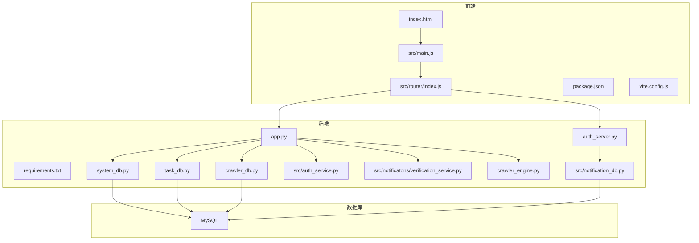
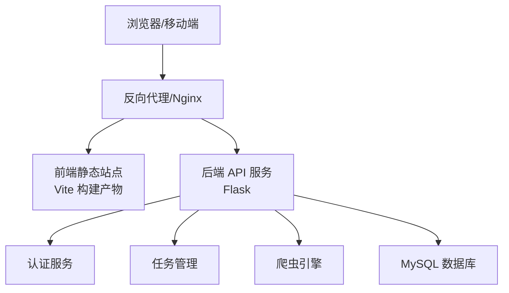
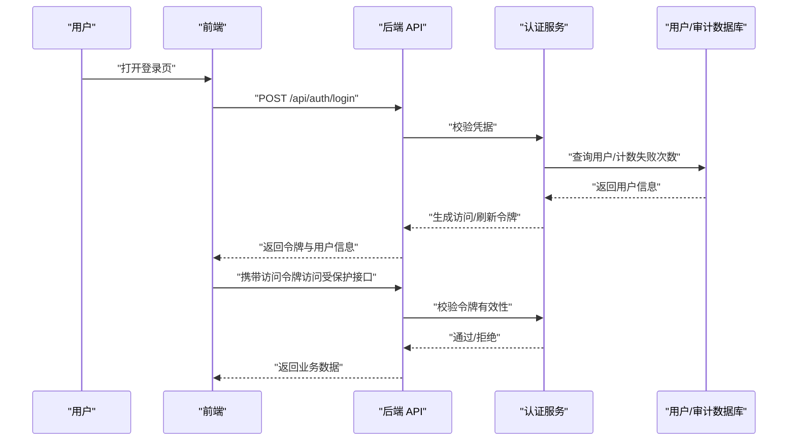
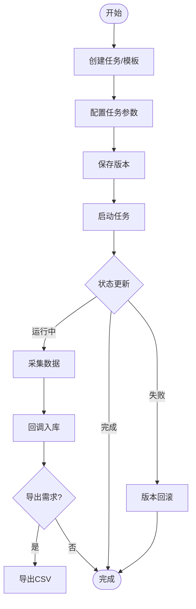
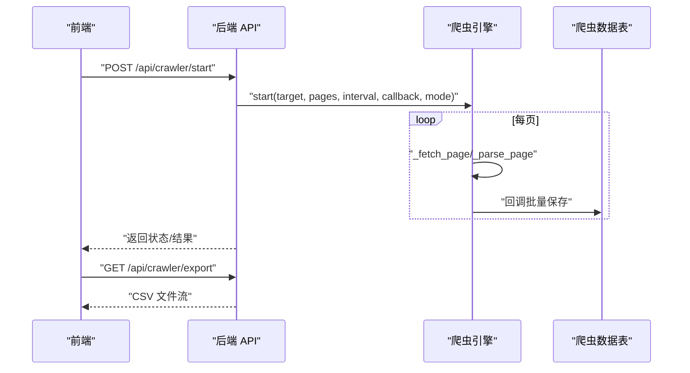
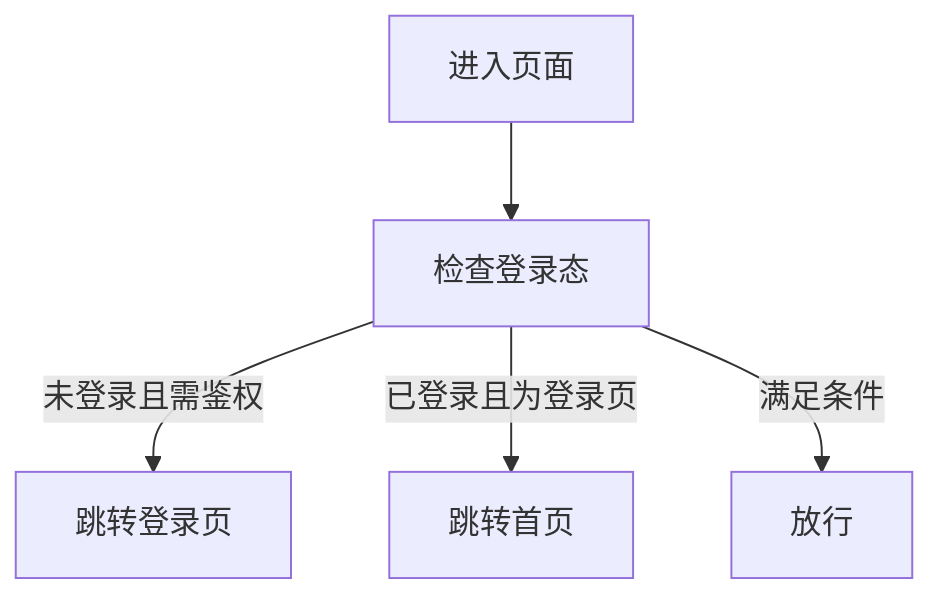
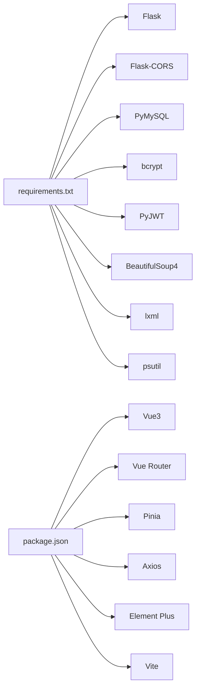
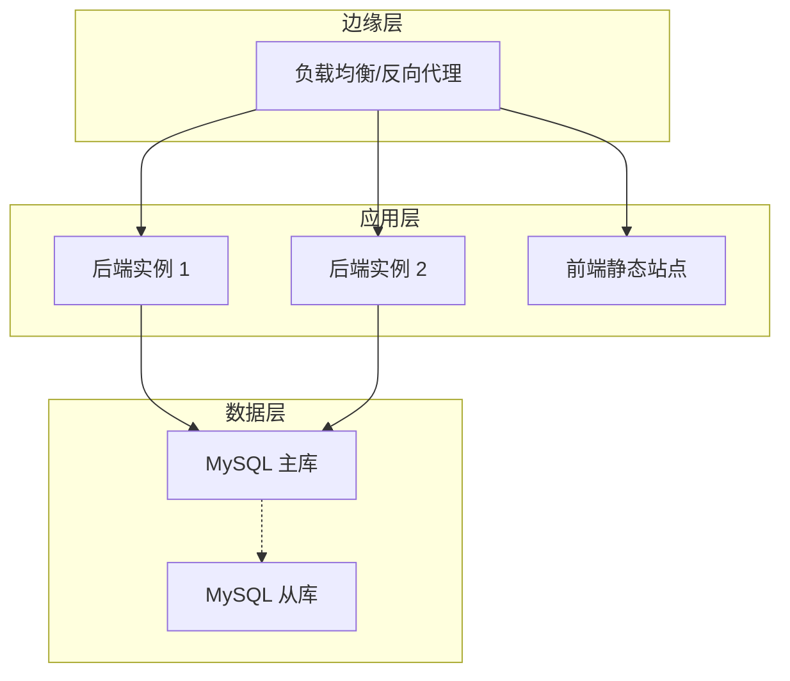
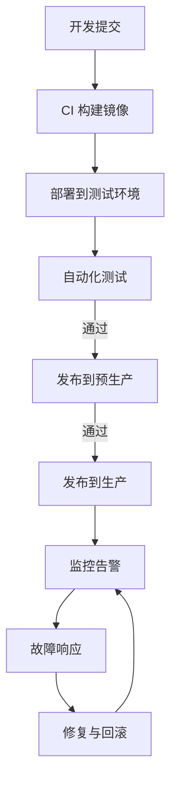

# 部署架构

<cite>
**本文引用的文件**
- [python/app.py](file://python/app.py)
- [python/auth_server.py](file://python/auth_server.py)
- [python/requirements.txt](file://python/requirements.txt)
- [python/system_db.py](file://python/system_db.py)
- [python/task_db.py](file://python/task_db.py)
- [python/crawler_db.py](file://python/crawler_db.py)
- [python/src/auth_service.py](file://python/src/auth_service.py)
- [python/src/notification_db.py](file://python/src/notification_db.py)
- [python/src/notifactions/verification_service.py](file://python/src/notificatons/verification_service.py)
- [python/crawler_engine.py](file://python/crawler_engine.py)
- [python-web/package.json](file://python-web/package.json)
- [python-web/vite.config.js](file://python-web/vite.config.js)
- [python-web/index.html](file://python-web/index.html)
- [python-web/src/main.js](file://python-web/src/main.js)
- [python-web/src/router/index.js](file://python-web/src/router/index.js)
</cite>

## 目录
1. [简介](#简介)
2. [项目结构](#项目结构)
3. [核心组件](#核心组件)
4. [架构总览](#架构总览)
5. [详细组件分析](#详细组件分析)
6. [依赖关系分析](#依赖关系分析)
7. [性能考虑](#性能考虑)
8. [故障排查指南](#故障排查指南)
9. [结论](#结论)
10. [附录](#附录)

## 简介
本部署架构文档面向该代码库的前后端分离部署方案，涵盖开发、测试与生产环境的配置要点，以及容器化与微服务化的倾向性建议。系统采用 Python Flask 后端提供 REST API，Vue3 前端通过 Vite 构建，数据库使用 MySQL，具备认证鉴权、任务调度、爬虫采集与导出等能力。文档重点说明：
- 前后端分离部署策略与静态资源托管
- 容器化部署选项与编排思路
- 微服务化倾向与模块边界
- 开发/测试/生产环境配置差异
- 负载均衡、反向代理与 SSL 证书管理
- 数据库部署、备份与监控告警
- 部署拓扑图与运维流程图

## 项目结构
项目由三层组成：
- 后端 Python 应用：提供认证、任务管理、爬虫接口与健康检查
- 前端 Vue3 应用：基于 Vite 开发，路由守卫实现鉴权
- 数据库：MySQL，分别承载用户与审计日志、任务与版本、爬虫数据等

图表来源
- [python/app.py:1-100](file://python/app.py#L1-L100)
- [python/auth_server.py:1-50](file://python/auth_server.py#L1-L50)
- [python/system_db.py:1-50](file://python/system_db.py#L1-L50)
- [python/task_db.py:1-50](file://python/task_db.py#L1-L50)
- [python/crawler_db.py:1-50](file://python/crawler_db.py#L1-L50)
- [python/src/auth_service.py:1-50](file://python/src/auth_service.py#L1-L50)
- [python/src/notification_db.py:1-50](file://python/src/notification_db.py#L1-L50)
- [python/src/notificatons/verification_service.py:1-50](file://python/src/notificatons/verification_service.py#L1-L50)
- [python/crawler_engine.py:1-50](file://python/crawler_engine.py#L1-L50)
- [python-web/index.html:1-13](file://python-web/index.html#L1-L13)
- [python-web/src/main.js:1-16](file://python-web/src/main.js#L1-L16)
- [python-web/src/router/index.js:1-50](file://python-web/src/router/index.js#L1-L50)

章节来源
- [python/app.py:1-100](file://python/app.py#L1-L100)
- [python/auth_server.py:1-50](file://python/auth_server.py#L1-L50)
- [python/system_db.py:1-50](file://python/system_db.py#L1-L50)
- [python/task_db.py:1-50](file://python/task_db.py#L1-L50)
- [python/crawler_db.py:1-50](file://python/crawler_db.py#L1-L50)
- [python/src/auth_service.py:1-50](file://python/src/auth_service.py#L1-L50)
- [python/src/notification_db.py:1-50](file://python/src/notification_db.py#L1-L50)
- [python/src/notificatons/verification_service.py:1-50](file://python/src/notificatons/verification_service.py#L1-L50)
- [python/crawler_engine.py:1-50](file://python/crawler_engine.py#L1-L50)
- [python-web/index.html:1-13](file://python-web/index.html#L1-L13)
- [python-web/src/main.js:1-16](file://python-web/src/main.js#L1-L16)
- [python-web/src/router/index.js:1-50](file://python-web/src/router/index.js#L1-L50)

## 核心组件
- 认证与授权服务
  - Flask 接口：注册、登录、刷新、登出、忘记密码验证码发送与校验
  - JWT 访问令牌与刷新令牌，黑名单机制，登录失败锁定
- 任务管理与版本控制
  - 任务生命周期管理、模板、版本回滚、收藏
- 爬虫引擎与数据存储
  - 多模式爬取（链接/图片/混合）、去重、回调入库、导出 CSV
- 前端路由与鉴权
  - Vue3 + Vue Router + Pinia，路由守卫校验登录态
- 数据库层
  - 用户与审计日志、系统日志与设置、任务与版本、爬虫数据

章节来源
- [python/src/auth_service.py:1-187](file://python/src/auth_service.py#L1-L187)
- [python/src/notification_db.py:1-120](file://python/src/notification_db.py#L1-L120)
- [python/src/notificatons/verification_service.py:1-108](file://python/src/notificatons/verification_service.py#L1-L108)
- [python/task_db.py:1-120](file://python/task_db.py#L1-L120)
- [python/crawler_engine.py:1-120](file://python/crawler_engine.py#L1-L120)
- [python/crawler_db.py:1-120](file://python/crawler_db.py#L1-L120)
- [python-web/src/router/index.js:129-147](file://python-web/src/router/index.js#L129-L147)

## 架构总览
系统采用前后端分离部署，后端提供 REST API，前端通过静态资源服务对外提供界面。数据库统一由 MySQL 托管，各模块通过独立的数据层封装访问。

图表来源
- [python/app.py:1-60](file://python/app.py#L1-L60)
- [python/auth_server.py:1-50](file://python/auth_server.py#L1-L50)
- [python-web/vite.config.js:1-11](file://python-web/vite.config.js#L1-L11)

## 详细组件分析

### 认证与授权服务
- 认证流程
  - 登录：校验凭据、生成访问/刷新令牌、写入审计日志
  - 刷新：校验刷新令牌有效性，签发新的访问令牌
  - 登出：加入黑名单，记录审计日志
  - 忘记密码：按邮箱/手机号发送验证码，校验后重置密码
- 安全特性
  - 密码哈希与历史密码限制
  - 登录失败锁定与解锁
  - Token 黑名单与过期控制
  - CORS 配置仅允许本地开发源

图表来源
- [python/app.py:99-140](file://python/app.py#L99-L140)
- [python/src/auth_service.py:76-118](file://python/src/auth_service.py#L76-L118)
- [python/src/notification_db.py:228-295](file://python/src/notification_db.py#L228-L295)

章节来源
- [python/app.py:99-240](file://python/app.py#L99-L240)
- [python/src/auth_service.py:76-183](file://python/src/auth_service.py#L76-L183)
- [python/src/notification_db.py:106-180](file://python/src/notification_db.py#L106-L180)
- [python/src/notificatons/verification_service.py:25-101](file://python/src/notificatons/verification_service.py#L25-L101)

### 任务管理与版本控制
- 任务 CRUD、状态管理、模板与收藏
- 版本保存与回滚，变更日志记录
- 与爬虫引擎协作，触发采集任务

图表来源
- [python/task_db.py:172-246](file://python/task_db.py#L172-L246)
- [python/task_db.py:367-444](file://python/task_db.py#L367-L444)
- [python/crawler_engine.py:464-497](file://python/crawler_engine.py#L464-L497)
- [python/crawler_db.py:96-139](file://python/crawler_db.py#L96-L139)

章节来源
- [python/task_db.py:123-283](file://python/task_db.py#L123-L283)
- [python/task_db.py:367-531](file://python/task_db.py#L367-L531)
- [python/crawler_engine.py:400-517](file://python/crawler_engine.py#L400-L517)
- [python/crawler_db.py:141-221](file://python/crawler_db.py#L141-L221)

### 爬虫引擎与数据存储
- 引擎特性：多模式解析、UA/语言轮换、请求延时、重试与异常处理
- 数据入库：回调批量插入，索引优化，类型字段扩展
- 导出：CSV 导出接口

图表来源
- [python/app.py:306-380](file://python/app.py#L306-L380)
- [python/crawler_engine.py:400-497](file://python/crawler_engine.py#L400-L497)
- [python/crawler_db.py:96-139](file://python/crawler_db.py#L96-L139)

章节来源
- [python/crawler_engine.py:10-120](file://python/crawler_engine.py#L10-L120)
- [python/crawler_engine.py:171-398](file://python/crawler_engine.py#L171-L398)
- [python/crawler_db.py:48-94](file://python/crawler_db.py#L48-L94)
- [python/app.py:427-466](file://python/app.py#L427-L466)

### 前端路由与鉴权
- 路由守卫：未登录访问受保护路由跳转登录；已登录访问登录页跳转首页
- 登录态：本地存储访问令牌与用户信息，接口携带 Authorization

图表来源
- [python-web/src/router/index.js:134-147](file://python-web/src/router/index.js#L134-L147)

章节来源
- [python-web/src/router/index.js:1-150](file://python-web/src/router/index.js#L1-L150)
- [python-web/src/main.js:1-16](file://python-web/src/main.js#L1-L16)

## 依赖关系分析
- 后端依赖
  - Flask、Flask-CORS、PyMySQL、bcrypt、PyJWT、BeautifulSoup4、lxml、psutil 等
- 前端依赖
  - Vue3、Element Plus、Vue Router、Pinia、Axios、Vite

图表来源
- [python/requirements.txt:1-14](file://python/requirements.txt#L1-L14)
- [python-web/package.json:1-24](file://python-web/package.json#L1-L24)

章节来源
- [python/requirements.txt:1-14](file://python/requirements.txt#L1-L14)
- [python-web/package.json:1-24](file://python-web/package.json#L1-L24)

## 性能考虑
- 爬虫并发与节流
  - 引擎内置请求间隔与多 UA 轮换，避免被封禁
  - 建议在生产环境结合代理池与速率限制
- 数据库性能
  - 爬虫数据表与日志表建立索引，分页查询与模糊搜索需注意性能
  - 批量写入回调减少事务开销
- 前端性能
  - Vite 生产构建优化资源体积，按需加载组件
- 缓存与会话
  - 建议引入 Redis 存储会话与验证码缓存，减轻数据库压力

## 故障排查指南
- 健康检查
  - 后端提供 /api/health 接口，用于探活
- 常见问题定位
  - 认证失败：检查令牌格式、黑名单、过期与用户锁定状态
  - 爬虫异常：查看错误消息与状态，确认目标网站可访问性与反爬策略
  - 数据导出为空：确认采集数据是否存在与导出接口可用性
- 日志与审计
  - 用户审计日志记录登录/登出/改密等关键动作
  - 系统日志表用于记录系统事件与错误

章节来源
- [python/app.py:468-470](file://python/app.py#L468-L470)
- [python/src/notification_db.py:334-342](file://python/src/notification_db.py#L334-L342)
- [python/system_db.py:99-122](file://python/system_db.py#L99-L122)

## 结论
该系统具备清晰的前后端分离架构与模块化设计，适合采用容器化与微服务化演进。建议在生产环境中引入反向代理、SSL 终止、数据库高可用与备份、集中式日志与监控告警，并通过 CI/CD 自动化部署，持续提升稳定性与可维护性。

## 附录

### 开发/测试/生产环境配置要点
- 开发环境
  - 前端：Vite 默认端口，热更新
  - 后端：Flask debug 模式，本地数据库连接
- 测试环境
  - 使用独立数据库实例，最小化权限，启用慢查询日志
- 生产环境
  - 反向代理统一入口，开启 HTTPS，限流与 WAF
  - 数据库主从复制与定期备份，监控告警覆盖 CPU/内存/磁盘/网络/应用错误

### 负载均衡与反向代理
- 建议使用 Nginx 或 HAProxy 作为入口，实现：
  - HTTP/HTTPS 终止与证书管理
  - 负载均衡到多个后端实例
  - 静态资源直出与 Gzip 压缩
  - 速率限制与 IP 黑名单

### SSL 证书管理
- 使用 Let’s Encrypt 自动续期
- 将证书与私钥放置安全目录，仅授予 Nginx 读取权限

### 数据库部署与备份
- 部署策略
  - 主从复制，读写分离
  - 关键表建立合适索引，定期分析与优化
- 备份策略
  - 全量+增量备份，保留至少 7 天全备
  - 定期恢复演练，确保备份可用性
- 监控告警
  - 连接数、慢查询、锁等待、磁盘空间、主从延迟

### 容器化与微服务化倾向
- 容器化
  - 后端：Python Flask 服务容器，挂载配置与日志卷
  - 前端：Nginx 静态资源容器，映射构建产物
  - 数据库：MySQL 容器，持久化卷
- 微服务化倾向
  - 认证服务可独立拆分，便于统一鉴权与 SSO
  - 任务调度与爬虫可独立扩缩容，结合消息队列异步化

### 部署拓扑图

[本图为概念性拓扑示意，不直接映射具体源文件]

### 运维流程图

[本图为概念性流程示意，不直接映射具体源文件]