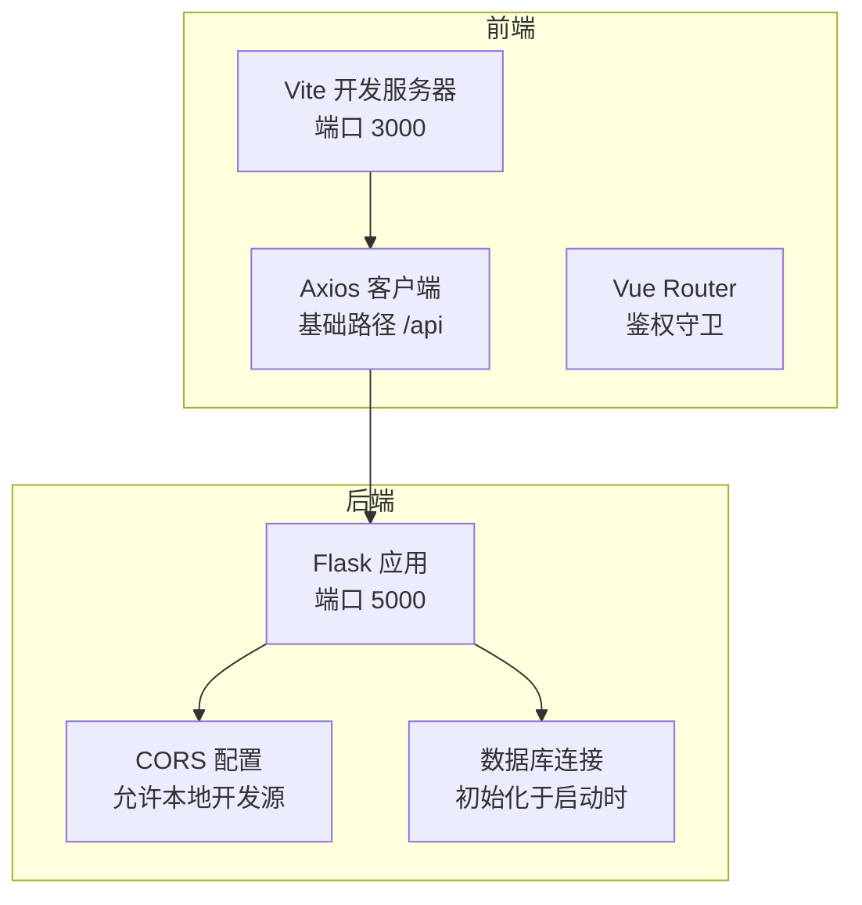
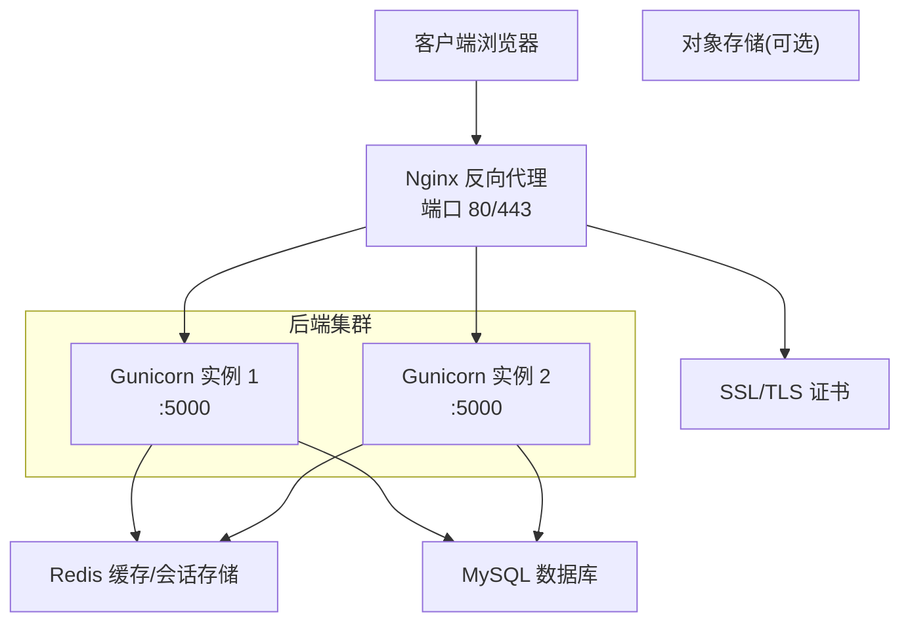
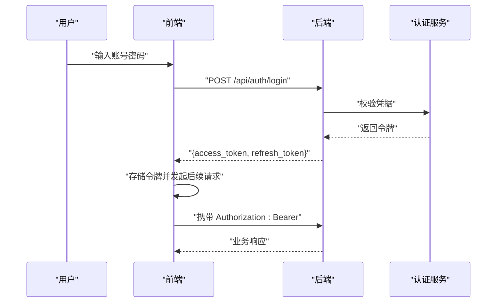
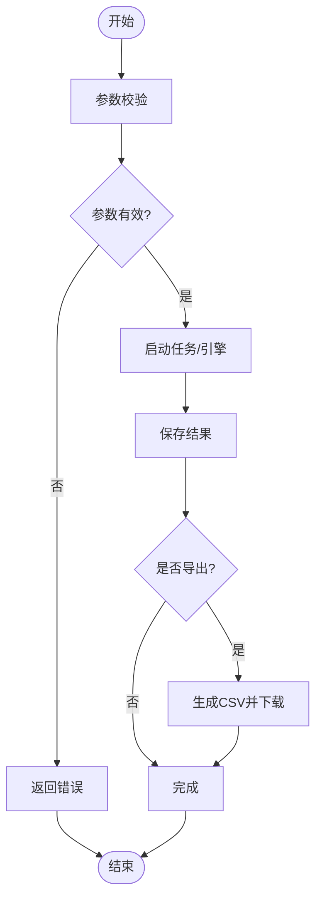
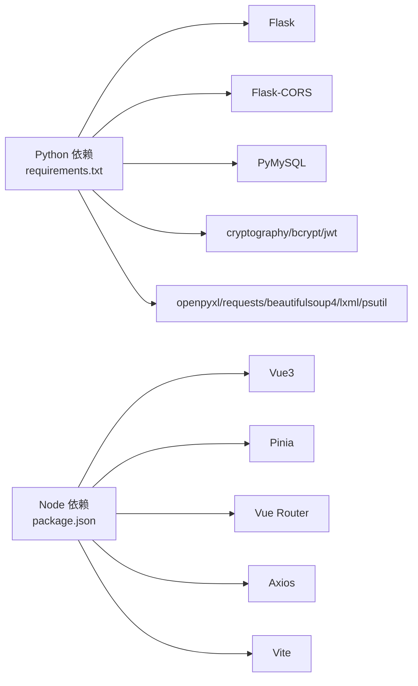

# 部署指南

<cite>
**本文引用的文件**
- [requirements.txt](file://python/requirements.txt)
- [app.py](file://python/app.py)
- [start.sh](file://python/start.sh)
- [start.bat](file://python/start.bat)
- [package.json](file://python-web/package.json)
- [vite.config.js](file://python-web/vite.config.js)
- [index.js](file://python-web/src/api/index.js)
- [index.js](file://python-web/src/router/index.js)
- [config.py](file://python/src/notifications/config.py)
- [auth_service.py](file://python/src/auth_service.py)
- [models.py](file://python/src/models.py)
- [utils.py](file://python/src/utils.py)
- [main.py](file://python/main.py)
</cite>

## 目录
1. [简介](#简介)
2. [项目结构](#项目结构)
3. [核心组件](#核心组件)
4. [架构总览](#架构总览)
5. [详细组件分析](#详细组件分析)
6. [依赖分析](#依赖分析)
7. [性能考虑](#性能考虑)
8. [故障排除指南](#故障排除指南)
9. [结论](#结论)
10. [附录](#附录)

## 简介
本指南面向需要将学生管理系统部署到生产环境的开发者，覆盖服务器环境准备、依赖安装、数据库配置、反向代理设置、Docker 容器化部署、Nginx 配置与 SSL 证书、负载均衡、监控告警、日志管理、备份恢复策略、版本更新流程以及常见问题排查。系统由 Python Flask 后端与 Vue3 前端组成，采用 JWT 进行认证，支持爬虫任务调度与数据导出等能力。

## 项目结构
系统分为前后端两部分：
- 后端：基于 Flask 的统一 API 服务，提供认证、任务管理、爬虫管理、健康检查等接口。
- 前端：基于 Vue3 + Vite 的单页应用，通过 Axios 访问后端 API，路由守卫控制鉴权。

图表来源
- [vite.config.js:1-11](file://python-web/vite.config.js#L1-L11)
- [index.js:1-95](file://python-web/src/api/index.js#L1-L95)
- [index.js:1-150](file://python-web/src/router/index.js#L1-L150)
- [app.py:18-28](file://python/app.py#L18-L28)

章节来源
- [requirements.txt:1-14](file://python/requirements.txt#L1-L14)
- [start.sh:1-39](file://python/start.sh#L1-L39)
- [start.bat:1-47](file://python/start.bat#L1-L47)
- [package.json:1-24](file://python-web/package.json#L1-L24)
- [vite.config.js:1-11](file://python-web/vite.config.js#L1-L11)
- [index.js:1-95](file://python-web/src/api/index.js#L1-L95)
- [index.js:1-150](file://python-web/src/router/index.js#L1-L150)
- [app.py:18-28](file://python/app.py#L18-L28)

## 核心组件
- Flask 应用与路由：提供认证、任务、爬虫、健康检查等 API；启用 CORS 支持本地开发。
- 认证服务：基于 bcrypt 密码哈希与 JWT 令牌，支持访问令牌刷新与黑名单。
- 通知配置：支持阿里云短信与邮件配置，可通过环境变量启用。
- 前端 Axios：统一拦截器处理鉴权头与自动刷新逻辑。
- 前端路由：全局守卫控制登录态与页面跳转。

章节来源
- [app.py:468-471](file://python/app.py#L468-L471)
- [auth_service.py:1-187](file://python/src/auth_service.py#L1-L187)
- [config.py:1-20](file://python/src/notifications/config.py#L1-L20)
- [index.js:1-95](file://python-web/src/api/index.js#L1-L95)
- [index.js:129-147](file://python-web/src/router/index.js#L129-L147)

## 架构总览
生产部署建议采用“反向代理 + 多实例 + 数据库 + 缓存/队列”的架构，前端静态资源由 Nginx 提供，后端通过反向代理暴露 API。

## 详细组件分析

### 后端部署要点
- 服务器环境
  - 操作系统：Linux（推荐 Ubuntu 20.04+）
  - Python：3.8+（建议使用虚拟环境）
  - 数据库：MySQL（需提前创建数据库与用户）
  - 反向代理：Nginx（用于 SSL 终止与静态资源）
- 依赖安装
  - 使用 requirements.txt 安装后端依赖
  - 生产建议使用 pipenv/poetry 或 Docker
- 数据库配置
  - 在启动前初始化数据库连接（应用启动时会进行连接）
  - 建议在生产环境设置连接池与只读副本
- 运行方式
  - 开发：使用 start.sh/start.bat 启动后端
  - 生产：使用 Gunicorn/Uvicorn + systemd 管理进程
- CORS 与安全
  - 生产环境应限制允许的源，避免通配符
  - 启用 HTTPS 并设置安全响应头
- 健康检查
  - 对外暴露 /api/health 接口，便于负载均衡探活

章节来源
- [requirements.txt:1-14](file://python/requirements.txt#L1-L14)
- [start.sh:18-38](file://python/start.sh#L18-L38)
- [start.bat:19-44](file://python/start.bat#L19-L44)
- [app.py:18-28](file://python/app.py#L18-L28)
- [app.py:468-471](file://python/app.py#L468-L471)

### 前端部署要点
- 构建产物
  - 使用 npm run build 生成静态资源
  - 将 dist 或构建输出目录交给 Nginx 提供
- 开发与生产差异
  - 开发：Vite 默认端口 3000
  - 生产：Nginx 反代至静态资源目录
- 跨域与鉴权
  - Axios 基础路径指向后端 /api
  - 前端路由守卫结合本地存储的令牌控制访问

章节来源
- [package.json:6-10](file://python-web/package.json#L6-L10)
- [vite.config.js:6-10](file://python-web/vite.config.js#L6-L10)
- [index.js:3-9](file://python-web/src/api/index.js#L3-L9)
- [index.js:129-147](file://python-web/src/router/index.js#L129-L147)

### 认证与安全
- JWT 令牌
  - 访问令牌短期有效，刷新令牌长期有效
  - 登出时加入黑名单，防止复用
- 密码策略
  - bcrypt 哈希，禁止重复使用历史密码
- 登录防护
  - 多次失败锁定与尝试计数
- 通知配置
  - 阿里云短信/邮件开关与模板配置
  - 通过环境变量启用与覆盖默认值

图表来源
- [auth_service.py:76-118](file://python/src/auth_service.py#L76-L118)
- [index.js:11-59](file://python-web/src/api/index.js#L11-L59)

章节来源
- [auth_service.py:1-187](file://python/src/auth_service.py#L1-L187)
- [config.py:1-20](file://python/src/notifications/config.py#L1-L20)
- [index.js:1-95](file://python-web/src/api/index.js#L1-L95)

### 爬虫与任务管理
- 爬虫启动/停止/状态查询
- 数据分页查询、清空与导出
- 任务模板与版本回滚
- 建议生产中配合队列（如 Celery/RQ）与持久化存储

图表来源
- [app.py:306-351](file://python/app.py#L306-L351)
- [app.py:382-424](file://python/app.py#L382-L424)

章节来源
- [app.py:306-424](file://python/app.py#L306-L424)

### 数据模型与工具
- 示例模型：Person/Student、Rectangle/Circle
- 示例算法：排序、搜索、数学运算
- 用于演示与测试，生产部署可忽略或移除

章节来源
- [models.py:1-59](file://python/src/models.py#L1-L59)
- [utils.py:1-76](file://python/src/utils.py#L1-L76)
- [main.py:1-60](file://python/main.py#L1-L60)

## 依赖分析
- 后端依赖
  - Web 框架与跨域：Flask、Flask-CORS
  - 数据库：PyMySQL
  - 加解密与安全：cryptography、bcrypt、PyJWT
  - 工具库：openpyxl、requests、beautifulsoup4、lxml、psutil
- 前端依赖
  - 框架与状态管理：Vue3、Pinia、Vue Router
  - HTTP 客户端：Axios
  - 构建工具：Vite、@vitejs/plugin-vue

图表来源
- [requirements.txt:1-14](file://python/requirements.txt#L1-L14)
- [package.json:11-22](file://python-web/package.json#L11-L22)

章节来源
- [requirements.txt:1-14](file://python/requirements.txt#L1-L14)
- [package.json:11-22](file://python-web/package.json#L11-L22)

## 性能考虑
- 连接池与并发
  - 后端使用连接池减少数据库开销
  - 前端请求超时与重试策略合理配置
- 缓存
  - 使用 Redis 缓存热点数据与会话
- 日志与监控
  - 后端记录访问日志与错误日志
  - 前端上报关键事件与错误
- 负载均衡
  - 多实例部署，健康检查端点用于探活
- 静态资源优化
  - 前端构建开启压缩与缓存策略

## 故障排除指南
- 启动失败
  - 检查 Python 版本与依赖安装
  - 查看后端日志与端口占用
- 认证异常
  - 确认 JWT 密钥与过期时间配置
  - 检查黑名单表是否正确写入
- CORS 错误
  - 生产环境限制允许源，避免通配符
- 数据库连接
  - 确认连接参数、网络连通性与权限
- 前端无法访问后端
  - 检查 Axios 基础路径与反向代理配置
- 爬虫任务异常
  - 检查目标站点可用性与频率限制
  - 关注导出与清理操作的日志

章节来源
- [start.sh:8-25](file://python/start.sh#L8-L25)
- [start.bat:9-26](file://python/start.bat#L9-L26)
- [auth_service.py:158-183](file://python/src/auth_service.py#L158-L183)
- [app.py:18-28](file://python/app.py#L18-L28)
- [index.js:3-9](file://python-web/src/api/index.js#L3-L9)

## 结论
通过合理的服务器环境准备、依赖管理、数据库配置与反向代理设置，结合 Docker 容器化与 Nginx SSL 终止，可以实现高可用的学生管理系统生产部署。配合负载均衡、监控告警、日志管理与备份恢复策略，能够保障系统稳定运行与高效维护。

## 附录

### Docker 容器化部署（建议步骤）
- 构建镜像
  - 使用多阶段构建，分离开发与运行时环境
  - 前端构建产物复制至 Nginx 镜像
- 编排
  - docker-compose 管理后端与 Nginx
  - 使用卷挂载配置文件与日志目录
- 环境变量
  - 数据库连接、JWT 密钥、通知服务参数通过环境变量注入
- 健康检查
  - 对后端 /api/health 设置探针

### Nginx 配置要点
- SSL 终止：配置证书与私钥
- 反向代理：将 /api 路径转发至后端
- 静态资源：提供前端构建产物
- 安全头：设置 HSTS、CSP 等

### 负载均衡与高可用
- 多实例后端：使用 Gunicorn + 多 worker
- 健康检查：定期探测 /api/health
- 自动扩缩容：结合容器编排平台

### 监控告警与日志管理
- 后端：集中式日志收集（如 ELK/Fluentd），指标采集（如 Prometheus）
- 前端：错误上报与性能监控（如 Sentry/Google Analytics）
- 告警：阈值触发与通知（邮件/IM）

### 备份恢复策略
- 数据库：定时快照与增量备份
- 配置与日志：版本化存储与异地备份
- 回滚：蓝绿发布或滚动更新，保留回滚分支

### 版本更新流程
- 测试：自动化测试与集成测试
- 预发布：灰度发布与 A/B 测试
- 发布：零停机更新（滚动重启）
- 回滚：一键回滚至上一稳定版本