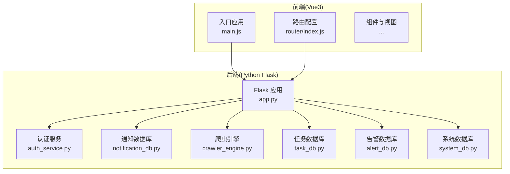
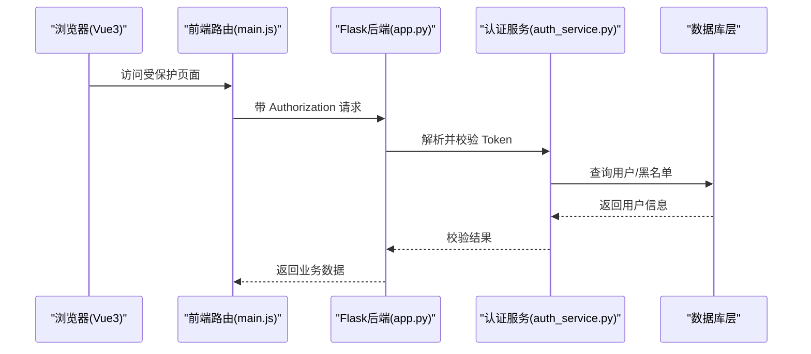
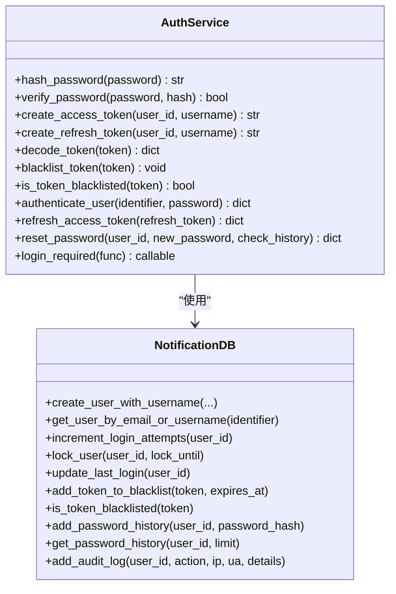
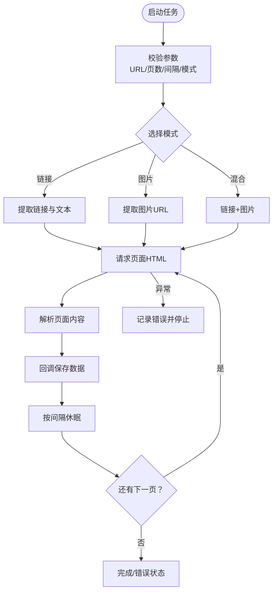
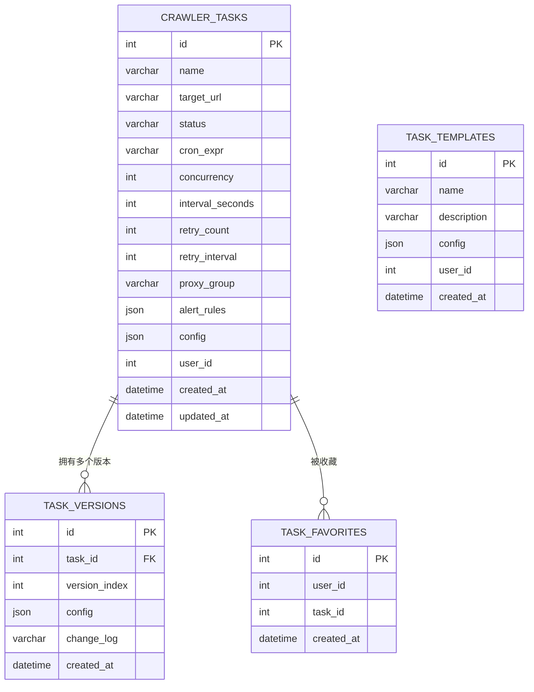
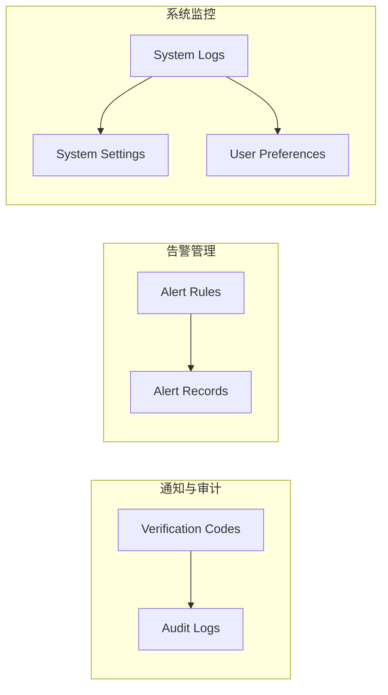
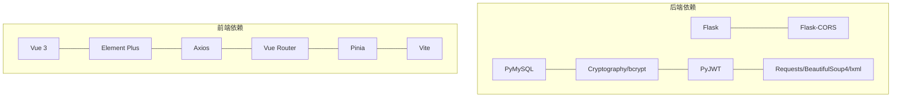

# 项目概述

<cite>
**本文档引用的文件**
- [app.py](file://python/app.py)
- [auth_service.py](file://python/src/auth_service.py)
- [notification_db.py](file://python/src/notification_db.py)
- [crawler_engine.py](file://python/crawler_engine.py)
- [task_db.py](file://python/task_db.py)
- [alert_db.py](file://python/alert_db.py)
- [system_db.py](file://python/system_db.py)
- [requirements.txt](file://python/requirements.txt)
- [main.js](file://python-web/src/main.js)
- [router/index.js](file://python-web/src/router/index.js)
- [package.json](file://python-web/package.json)
- [README.md](file://python-web/README.md)
- [models.py](file://python/src/models.py)
- [main.py](file://python/main.py)
</cite>

## 目录
1. [引言](#引言)
2. [项目结构](#项目结构)
3. [核心组件](#核心组件)
4. [架构总览](#架构总览)
5. [详细组件分析](#详细组件分析)
6. [依赖关系分析](#依赖关系分析)
7. [性能考虑](#性能考虑)
8. [故障排除指南](#故障排除指南)
9. [结论](#结论)

## 引言
本项目是一个前后端分离的全栈学生管理系统，采用 Python Flask 作为后端服务，Vue3 + Vite 作为前端界面。系统围绕五大核心功能模块展开：用户认证与安全、学生数据管理、爬虫数据采集、任务管理与调度、通知与告警系统。项目旨在为用户提供现代化、可扩展且易于维护的教育数据管理平台。

## 项目结构
项目采用典型的前后端分离架构，后端位于 python 目录，前端位于 python-web 目录。后端通过 Flask 提供 RESTful API，前端通过 Vue3 单页应用与后端交互。

**图表来源**
- [app.py:1-1715](file://python/app.py#L1-L1715)
- [auth_service.py:1-187](file://python/src/auth_service.py#L1-L187)
- [notification_db.py:1-357](file://python/src/notification_db.py#L1-L357)
- [crawler_engine.py:1-533](file://python/crawler_engine.py#L1-L533)
- [task_db.py:1-533](file://python/task_db.py#L1-L533)
- [alert_db.py:1-314](file://python/alert_db.py#L1-L314)
- [system_db.py:1-317](file://python/system_db.py#L1-L317)
- [main.js:1-16](file://python-web/src/main.js#L1-L16)
- [router/index.js:1-66](file://python-web/src/router/index.js#L1-L66)

**章节来源**
- [app.py:1-1715](file://python/app.py#L1-L1715)
- [main.js:1-16](file://python-web/src/main.js#L1-L16)
- [router/index.js:1-66](file://python-web/src/router/index.js#L1-L66)

## 核心组件
- 用户认证系统：基于 JWT 的登录/登出/刷新机制，配合密码哈希与登录尝试限制，确保账户安全。
- 爬虫数据采集：多线程爬虫引擎，支持链接/图片/混合模式，具备反爬策略与错误处理。
- 任务管理系统：任务生命周期管理、模板化配置、版本控制与收藏功能。
- 通知系统：邮件/SMS 验证码、审计日志与用户偏好设置。
- 系统监控：系统日志、设置与用户偏好持久化，便于运维与个性化配置。

**章节来源**
- [auth_service.py:1-187](file://python/src/auth_service.py#L1-L187)
- [notification_db.py:1-357](file://python/src/notification_db.py#L1-L357)
- [crawler_engine.py:1-533](file://python/crawler_engine.py#L1-L533)
- [task_db.py:1-533](file://python/task_db.py#L1-L533)
- [alert_db.py:1-314](file://python/alert_db.py#L1-L314)
- [system_db.py:1-317](file://python/system_db.py#L1-L317)

## 架构总览
系统采用前后端分离设计，前端通过 Axios 发起 HTTP 请求，后端提供 REST API 并统一处理跨域。认证采用 Bearer Token 方案，所有受保护接口均需携带有效 Token。

**图表来源**
- [app.py:1-1715](file://python/app.py#L1-L1715)
- [auth_service.py:158-184](file://python/src/auth_service.py#L158-L184)
- [main.js:1-16](file://python-web/src/main.js#L1-L16)

**章节来源**
- [app.py:18-28](file://python/app.py#L18-L28)
- [auth_service.py:158-184](file://python/src/auth_service.py#L158-L184)

## 详细组件分析

### 用户认证系统
- 密码安全：bcrypt 哈希存储，密码历史校验防止重复使用。
- Token 管理：JWT 访问/刷新令牌，黑名单机制支持主动登出。
- 登录风控：最大尝试次数与临时锁定策略，提升抗暴力破解能力。
- 审计日志：登录/登出/改密等关键动作记录 IP 与 UA。

**图表来源**
- [auth_service.py:1-187](file://python/src/auth_service.py#L1-L187)
- [notification_db.py:1-357](file://python/src/notification_db.py#L1-L357)

**章节来源**
- [auth_service.py:1-187](file://python/src/auth_service.py#L1-L187)
- [notification_db.py:1-357](file://python/src/notification_db.py#L1-L357)

### 爬虫数据采集引擎
- 多模式解析：链接模式、图片模式、混合模式，覆盖常见采集场景。
- 反爬策略：UA/语言/接受头轮换，请求超时与重试，403/5xx 错误处理。
- 状态管理：线程安全的状态跟踪、运行时统计与错误信息。
- 回调集成：统一的数据保存回调，便于与数据库层解耦。

**图表来源**
- [crawler_engine.py:464-533](file://python/crawler_engine.py#L464-L533)

**章节来源**
- [crawler_engine.py:1-533](file://python/crawler_engine.py#L1-L533)

### 任务管理系统
- 任务生命周期：创建、查询、更新、删除、启动/停止。
- 模板化配置：模板创建与复用，降低重复配置成本。
- 版本控制：任务配置版本化，支持回滚与变更追踪。
- 收藏功能：用户收藏常用任务，提升使用效率。

**图表来源**
- [task_db.py:51-112](file://python/task_db.py#L51-L112)

**章节来源**
- [task_db.py:1-533](file://python/task_db.py#L1-L533)

### 通知与告警系统
- 验证码：邮箱/短信验证码，过期与使用状态管理。
- 审计日志：用户行为审计，便于合规与问题追溯。
- 告警规则：失败/超时/数据异常/IP 封禁等规则配置与记录。
- 系统日志：分级日志、来源分类与持久化存储。

**图表来源**
- [notification_db.py:60-103](file://python/src/notification_db.py#L60-L103)
- [alert_db.py:50-81](file://python/alert_db.py#L50-L81)
- [system_db.py:51-87](file://python/system_db.py#L51-L87)

**章节来源**
- [notification_db.py:1-357](file://python/src/notification_db.py#L1-L357)
- [alert_db.py:1-314](file://python/alert_db.py#L1-L314)
- [system_db.py:1-317](file://python/system_db.py#L1-L317)

## 依赖关系分析
后端依赖主要集中在 Web 框架、数据库驱动、加密与网络请求库；前端依赖 Vue3 生态与构建工具链。

**图表来源**
- [requirements.txt:1-13](file://python/requirements.txt#L1-L13)
- [package.json:11-22](file://python-web/package.json#L11-L22)

**章节来源**
- [requirements.txt:1-13](file://python/requirements.txt#L1-L13)
- [package.json:1-24](file://python-web/package.json#L1-L24)

## 性能考虑
- 爬虫并发与节流：通过请求间隔与线程模型平衡采集效率与目标站点稳定性。
- 数据库连接池：建议在生产环境引入连接池与索引优化，减少查询延迟。
- 前端资源优化：利用 Vite 的按需加载与 Tree Shaking，减少首屏体积。
- 缓存策略：对静态配置与不敏感数据进行缓存，减轻后端压力。
- 监控与日志：完善的系统日志与告警规则，有助于快速定位性能瓶颈。

## 故障排除指南
- 后端启动失败
  - 检查数据库连接配置与端口占用情况。
  - 确认依赖安装完整，特别是 lxml 的 C 扩展。
- 前端无法连接后端
  - 确认 CORS 配置允许前端域名与端口。
  - 检查后端健康检查接口是否可用。
- 登录鉴权异常
  - 核对 Token 类型与有效期，确认未被加入黑名单。
  - 检查用户账户状态与登录尝试次数。
- 爬虫采集失败
  - 关注错误状态码与错误信息，调整 UA/间隔策略。
  - 检查目标站点的 robots.txt 与反爬机制。
- 任务执行异常
  - 查看任务版本与配置差异，必要时回滚至上一版本。
  - 检查告警规则是否触发并影响任务状态。

**章节来源**
- [app.py:18-28](file://python/app.py#L18-L28)
- [auth_service.py:158-184](file://python/src/auth_service.py#L158-L184)
- [crawler_engine.py:508-518](file://python/crawler_engine.py#L508-L518)
- [task_db.py:420-445](file://python/task_db.py#L420-L445)

## 结论
本项目通过清晰的模块划分与成熟的开源技术栈，构建了一个功能完备、安全可靠的全栈学生管理系统。后端以 Flask 为核心，结合数据库层实现认证、采集、任务与监控功能；前端采用 Vue3 生态，提供现代化的用户体验。项目具备良好的扩展性与可维护性，适合进一步演进为企业级数据管理平台。