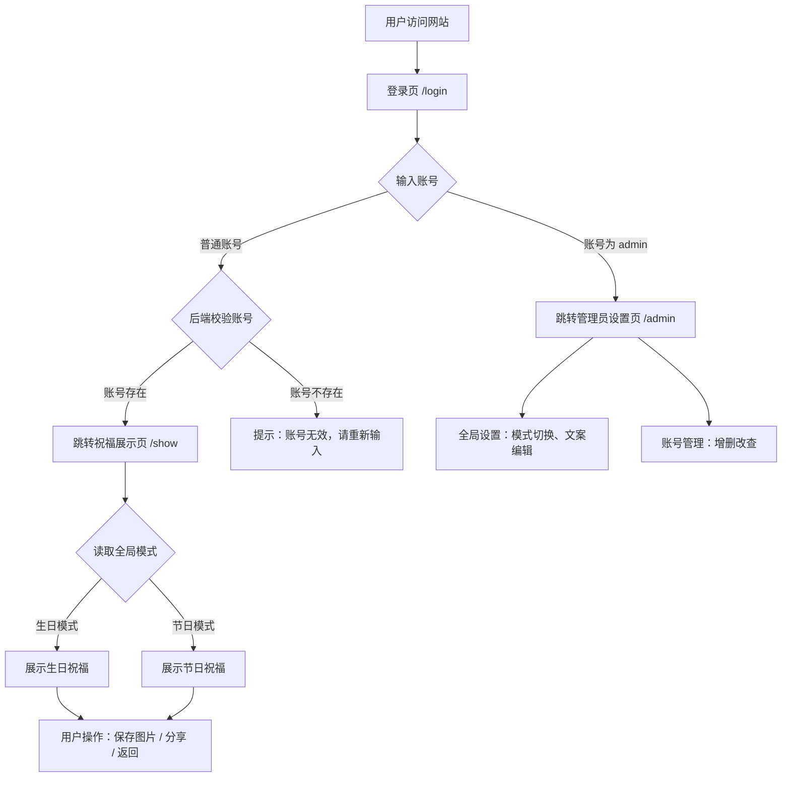

## 1. 产品概述

专属账号生日/节日自适应祝福网站 — 前后端分离移动端优先项目。管理员(admin)通过后台管理全局祝福模式（生日模式/节日模式二选一互斥），配置全局祝福文案；普通用户使用专属账号登录后，查看带有个人专属配色（背景色+文字色）的个性化祝福展示页面。节日模式下系统自动计算最近节日并生成默认祝福文案。

- **目标用户**：拥有专属账号的访客、网站管理员
- **核心价值**：一人一色、一键切换、温馨治愈的个性化祝福体验

## 2. 核心功能

### 2.1 用户角色

| 角色 | 登录方式 | 核心权限 |
|------|----------|----------|
| 管理员(admin) | 输入admin登录 | 全局设置管理、账号管理 |
| 普通用户 | 输入专属账号登录 | 查看个性化祝福展示页 |

### 2.2 功能模块

1. **登录页**：专属账号输入、admin特权识别、普通用户校验
2. **祝福展示页**：全局模式自适应、个人配色渲染、图片保存与分享
3. **管理员全局设置页**：模式切换、文案编辑、节日刷新
4. **账号管理页**：账号增删改、配色选择、唯一性校验

### 2.3 页面详情

| 页面名称 | 模块名称 | 功能描述 |
|----------|----------|----------|
| 登录页 /login | 账号输入区 | 无密码仅输入账号，admin跳转后台，普通用户跳转祝福页 |
| 登录页 /login | 提示信息 | 底部小字提示：专属定制祝福，只为一人 |
| 祝福展示页 /show | 祝福标题区 | 根据全局模式显示【生日快乐】或【XXX节日快乐】 |
| 祝福展示页 /show | 祝福文案区 | 展示后台配置的生日/节日默认文案，全屏居中排版 |
| 祝福展示页 /show | 功能按钮区 | 保存祝福图片(html2canvas)、分享祝福(Native Share API)、返回登录 |
| 管理员设置页 /admin | 模式切换模块 | 单选按钮二选一：生日模式/节日模式 |
| 管理员设置页 /admin | 节日展示模块 | 自动显示当前匹配的最近节日名称和匹配时间 |
| 管理员设置页 /admin | 文案编辑模块 | 两个文本域：生日默认文案、节日默认文案 |
| 管理员设置页 /admin | 操作按钮 | 保存设置、刷新最近节日、跳转账号管理 |
| 账号管理页 /admin/user | 账号列表 | 展示所有普通账号、配色信息、创建时间、操作按钮 |
| 账号管理页 /admin/user | 新增/编辑账号 | 弹窗表单，输入账号名、选择背景色、选择文字色 |
| 账号管理页 /admin/user | 删除账号 | 二次确认弹窗，防止误删 |

## 3. 核心流程

## 4. 用户界面设计

### 4.1 设计风格

- **主题色调**：温馨治愈风格，柔和温暖色系
- **主色调**：粉色系（#fef5f8 为默认背景）、暖色调渐变按钮
- **按钮样式**：圆角柔和（border-radius: 12px-16px），渐变底色，点击缩放动效
- **字体**：系统默认中文字体，移动端自适应字号（标题 1.5rem-2rem，正文 1rem-1.2rem）
- **布局风格**：Flex + Grid 布局，全屏居中，移动端优先
- **动画**：页面渐入(fadeIn)、按钮缩放(scale)、轻量化微交互，无花哨特效

### 4.2 页面设计概览

| 页面名称 | 模块名称 | UI元素 |
|----------|----------|--------|
| 登录页 | 账号输入区 | 居中布局，标题「专属祝福入口」，输入框圆角12px，placeholder「请输入专属账号」，渐变按钮「立即进入」 |
| 登录页 | 提示信息 | 底部居中，小字灰色，文字「专属定制祝福，只为一人」 |
| 祝福展示页 | 祝福内容区 | 全屏自适应，背景色=用户bg_color，文字色=用户text_color，标题大字居中，文案段落居中，行高1.8 |
| 祝福展示页 | 功能按钮区 | 底部固定，三个按钮横向排列，圆角柔和，点击缩放反馈 |
| 管理员设置页 | 模式切换 | 卡片式布局，两个大按钮/单选组，选中态高亮 |
| 管理员设置页 | 文案编辑 | 文本域(textarea)，圆角边框，充足内边距，最小高度120px |
| 管理员设置页 | 操作按钮 | 底部固定或跟随内容，主按钮醒目，次按钮低调 |
| 账号管理页 | 账号列表 | 表格/卡片列表，每行显示账号名、配色预览色块、创建时间、编辑/删除按钮 |
| 账号管理页 | 新增弹窗 | 居中模态弹窗，输入框+颜色选择器，实时预览配色效果 |

### 4.3 响应式适配

- **移动端优先**：基准宽度375px，100%适配所有手机屏幕，无横向滚动条
- **PC端适配**：最大宽度480px居中展示，背景柔和过渡
- **字体自适应**：使用 rem/em 单位，根据视口缩放
- **触摸优化**：按钮最小点击区域44x44px，间距充足