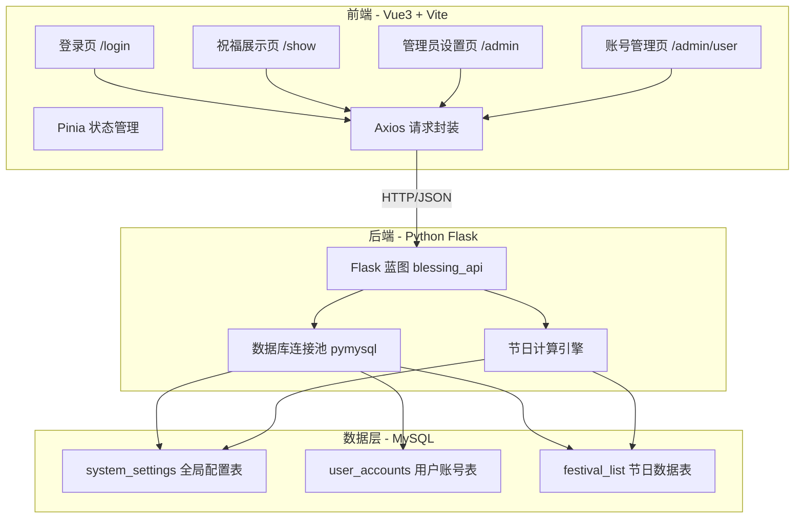
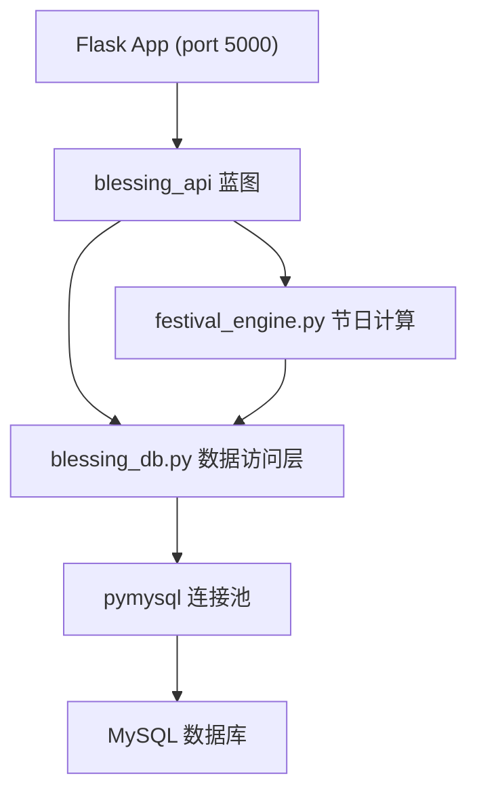
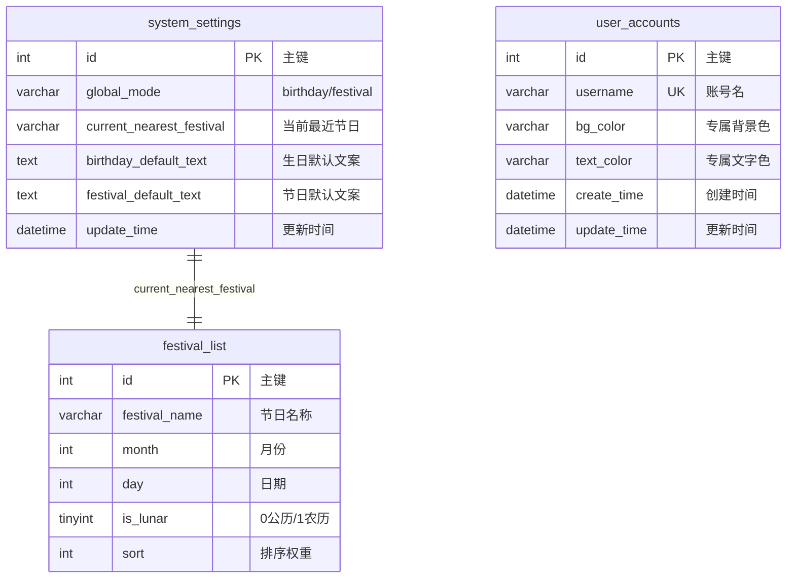

## 1. 架构设计



## 2. 技术说明

- **前端**：Vue@3（组合式API setup语法糖）+ Vite + Pinia + Axios + html2canvas + 原生CSS3（Flex+Grid）
- **初始化工具**：vite-init（vue-ts模板，移除Tailwind）
- **后端**：Python Flask + pymysql（数据库连接池）+ flask-cors（全局跨域）
- **数据库**：MySQL 8.0+
- **部署地址**：后端线上 `https://crawler-vue3.onrender.com`，本地端口5000

## 3. 路由定义

| 路由 | 页面 | 权限 |
|-------|------|------|
| /login | 登录页（默认首页） | 公开 |
| /show | 用户祝福展示页 | 登录用户 |
| /admin | 管理员全局设置页 | 仅admin |
| /admin/user | 账号管理页 | 仅admin |

## 4. API 接口定义

### 4.1 POST /api/login — 账号登录

```typescript
// Request
{ username: string }

// Response (admin)
{ code: 200, msg: "登录成功", data: { role: "admin", username: "admin" } }

// Response (普通用户)
{ code: 200, msg: "登录成功", data: { role: "user", username: "xxx", bg_color: "#fef5f8", text_color: "#333333" } }

// Response (账号不存在)
{ code: 400, msg: "账号无效", data: null }
```

### 4.2 GET /api/settings/get — 获取全局配置

```typescript
// Response
{
  code: 200, msg: "成功",
  data: {
    global_mode: "birthday" | "festival",
    current_nearest_festival: "春节",
    birthday_default_text: "...",
    festival_default_text: "...",
    update_time: "2024-01-01 12:00:00"
  }
}
```

### 4.3 POST /api/settings/update — 更新全局配置

```typescript
// Request
{
  global_mode: "birthday" | "festival",
  birthday_default_text: "...",
  festival_default_text: "..."
}

// Response
{ code: 200, msg: "配置更新成功", data: null }
```

### 4.4 GET /api/festival/nearest — 手动刷新最近节日

```typescript
// Response
{ code: 200, msg: "成功", data: { festival_name: "春节", festival_text: "..." } }
```

### 4.5 GET /api/user/list — 获取所有普通账号列表

```typescript
// Response
{
  code: 200, msg: "成功",
  data: [
    { id: 1, username: "user1", bg_color: "#fef5f8", text_color: "#333333", create_time: "..." },
    ...
  ]
}
```

### 4.6 POST /api/user/save — 新增/编辑账号

```typescript
// Request (新增)
{ username: "user2", bg_color: "#fff0f5", text_color: "#555555" }

// Request (编辑)
{ id: 1, username: "user1", bg_color: "#e8f4fd", text_color: "#222222" }

// Response
{ code: 200, msg: "保存成功", data: null }
// 或
{ code: 400, msg: "账号已存在", data: null }
```

### 4.7 DELETE /api/user/delete — 删除指定账号

```typescript
// Request
{ id: 1 }

// Response
{ code: 200, msg: "删除成功", data: null }
```

## 5. 服务端架构图



## 6. 数据模型

### 6.1 数据模型定义



### 6.2 数据定义语言 (DDL)

```sql
-- 全局配置表
CREATE TABLE IF NOT EXISTS `system_settings` (
  `id` INT NOT NULL AUTO_INCREMENT,
  `global_mode` VARCHAR(20) NOT NULL DEFAULT 'birthday' COMMENT '全局模式：birthday生日/festival节日',
  `current_nearest_festival` VARCHAR(50) NOT NULL DEFAULT '' COMMENT '当前自动匹配的最近节日名称',
  `birthday_default_text` TEXT NOT NULL COMMENT '生日模式全局默认祝福文案',
  `festival_default_text` TEXT NOT NULL COMMENT '节日模式全局默认祝福文案',
  `update_time` DATETIME NOT NULL DEFAULT CURRENT_TIMESTAMP COMMENT '配置更新时间',
  PRIMARY KEY (`id`)
) ENGINE=InnoDB DEFAULT CHARSET=utf8mb4 COMMENT='全局配置表';

-- 初始化默认配置
INSERT INTO `system_settings` (`id`, `global_mode`, `birthday_default_text`, `festival_default_text`)
VALUES (1, 'birthday', '愿你的每一天都充满阳光与欢笑，愿所有美好都如期而至。生日快乐！', '祝你节日快乐，阖家幸福，万事如意！');

-- 普通用户账号表
CREATE TABLE IF NOT EXISTS `user_accounts` (
  `id` INT NOT NULL AUTO_INCREMENT,
  `username` VARCHAR(30) NOT NULL COMMENT '登录账号名',
  `bg_color` VARCHAR(20) NOT NULL DEFAULT '#fef5f8' COMMENT '专属页面背景色',
  `text_color` VARCHAR(20) NOT NULL DEFAULT '#333333' COMMENT '专属页面文字色',
  `create_time` DATETIME NOT NULL DEFAULT CURRENT_TIMESTAMP COMMENT '账号创建时间',
  `update_time` DATETIME NOT NULL DEFAULT CURRENT_TIMESTAMP ON UPDATE CURRENT_TIMESTAMP COMMENT '账号更新时间',
  PRIMARY KEY (`id`),
  UNIQUE KEY `uk_username` (`username`)
) ENGINE=InnoDB DEFAULT CHARSET=utf8mb4 COMMENT='普通用户账号表';

-- 节日数据表
CREATE TABLE IF NOT EXISTS `festival_list` (
  `id` INT NOT NULL AUTO_INCREMENT,
  `festival_name` VARCHAR(50) NOT NULL COMMENT '节日名称',
  `month` INT NOT NULL COMMENT '月份',
  `day` INT NOT NULL COMMENT '日期',
  `is_lunar` TINYINT(1) NOT NULL DEFAULT 0 COMMENT '0=公历 1=农历',
  `sort` INT NOT NULL DEFAULT 0 COMMENT '排序权重',
  PRIMARY KEY (`id`)
) ENGINE=InnoDB DEFAULT CHARSET=utf8mb4 COMMENT='节日数据表';

-- 初始化6个默认节日数据
INSERT INTO `festival_list` (`festival_name`, `month`, `day`, `is_lunar`, `sort`) VALUES
('元旦', 1, 1, 0, 1),
('春节', 1, 1, 1, 2),
('情人节', 2, 14, 0, 3),
('母亲节', 5, 12, 0, 4),
('中秋节', 8, 15, 1, 5),
('圣诞节', 12, 25, 0, 6);
```

**注意**：农历节日（春节、中秋节）的实际公历日期需每年动态计算。后端通过 `zhdate` 库或内置农历转换逻辑实现农历到公历的转换，以准确匹配最近节日。母亲节为每年5月第二个星期日，后端需做动态计算。